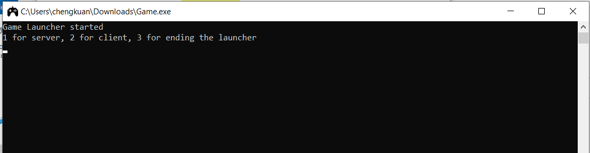
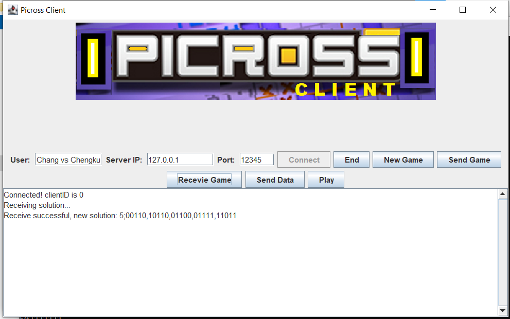
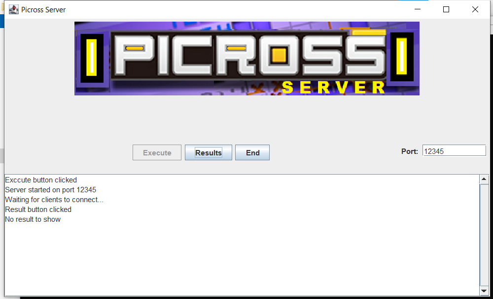
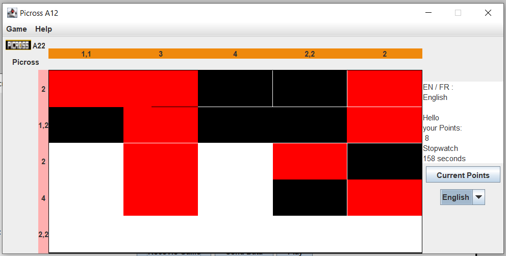

# Picross Game

## Table of Contents
- [Introduction](#introduction)
- [Technologies](#Technologies)
- [Pictures](#Pictures)
- [How to Play](#how-to-play)
- [Setup](#Setup)
- [Design Pattern and Architecture](#design-pattern-and-architecture)
- [File Structure](#file-structure)
- [Authors](#authors)

## Introduction
This project is a Picross game implemented in Java. It allows players to solve Picross puzzles by filling in a grid based on numerical clues. This picross game is built using the Model-View-Controller (MVC) architectural pattern, making it modular and easy to extend. It also features both server and client components, enabling multiplayer interactions.

##Pictures

## Technologies
- Java: The backbone of the application.
- Swing: For building a responsive and intuitive GUI.
- Java Sockets: For real-time, bi-directional communication between client and server.

## How to Play

### Gameplay Mechanics

In Picross, players tries to fill a grid based on number clues given at the side of the grid.

### Rules

- The game is a puzzle game where the players can connect to the server to start a game session. 
- Server and clients must be in the same local area network.
-  Follow the on-screen instructions to start both the server and the client components to play the game.
- Each number on the rows and columns indicates a group of filled-in blocks.
- There must be at least one blank cell between each group.
- The game is won when the hidden tiles are fully and correctly revealed.

## Setup
### Prerequisites
- Java Development Kit (JDK) 8 or higher
- A Java IDE (e.g., Eclipse, IntelliJ IDEA) (Optional)
- Network connection for multiplayer (Optional)

### Option 1 Run the Provided Batch File
Go to [Release](https://github.com/chengkuanz/Picross/releases) and download the latest `source_code.zip`and unzip it. 

Double-click the batch file `gameStarter.bat`and it will compile the code, create a JAR file, generate Javadocs, and run the game. 

### Option 2 Run the executable file
Go to [Release](https://github.com/chengkuanz/Picross/releases) and download the latest `Picross_exe.zip` and unzip it. 

Run the `Game.exe`, make sure `Game.exe` and `image` are in the same folder. 

## Design Pattern and Architecture
The project follows the MVC (Model-View-Controller) design pattern, ensuring a clean separation of concerns:

- Model(`GameModel.java`): Holds game state, logic, and rules.
- View (`GameView.java`): Responsible for all UI components and user interactions.
- Controller (`GameController.java`): Acts as an interface between the Model and the View, handling all application logic.

The game also employs a client-server model, with `GameServer.java` and `GameClient.java` handling server and client functionalities, respectively.

- Server (`GameServer.java`): Manages incoming connections, synchronizes game state, and sends updates to connected clients.
- Client (`GameClient.java`): Connects to the server, receives updates, and sends user inputs back to the server.

## File Structure
  - `src/Picross/Game.java`: Game launcher.
  - `src/Picross/GameClient.java`: Handles client-side functionalities.
  - `src/Picross/GameServer.java`: Manages server-side functionalities.
  - `src/Picross/GameController.java`: Controls interactions between the view and the model.
  - `src/Picross/GameModel.java`: Holds the game's core logic and properties.
- `src/Picross/GameView.java`: Handles the GUI and view logic.
- `src/Picross/GameConfig.java`: Contains game properties and network protocols.
- `bin/` : Contains the compiled Java classes and JAR file.
- `doc/` : Contains Javadoc documentation.
- `resources/texts`:Resource bundles that contains localized strings to facilitate the adaption of the application to different languages.
- `gameStarter.bat` : This batch file responsible to compile Java file useing 'javac', create JAR file using 'jar cvfe' command, generate Javadoc, and runing the JAR file

## Authors
This game was developed by [Chengkuan Zhao](https://github.com/chengkuanz) and [Chang Liu](https://github.com/lyalc542), starting from January 2023. Feel free to reach out for any questions or contributions.

last update: Sep 7 2023
